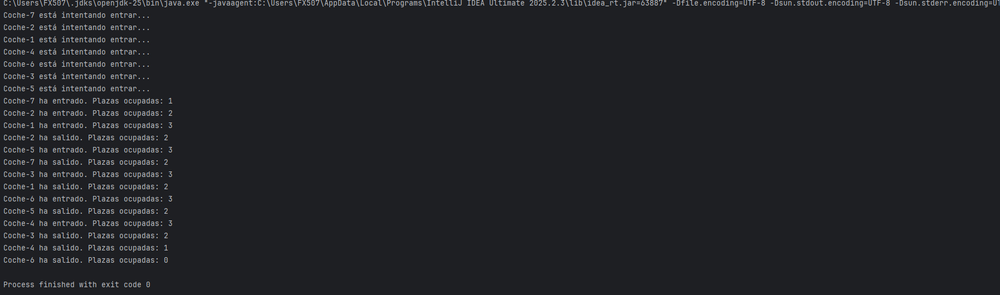

# 🚗 Control de Acceso Concurrente a un Aparcamiento con Semaphore

Este proyecto simula un aparcamiento con capacidad limitada (3 plazas) al que acceden 7 coches simultáneamente.
El objetivo es aplicar programación concurrente en Java mediante la clase Semaphore, garantizando que nunca haya más de 3 coches aparcados al mismo tiempo.

---

## 🧩 Objetivos de Aprendizaje
1. Comprender el uso de java.util.concurrent.Semaphore para gestionar recursos limitados.
2. Practicar la programación multihilo y la sincronización correcta entre hilos.
3. Evitar condiciones de carrera mediante exclusión mutua.
4. Aplicar buenas prácticas de documentación, modularidad y control de concurrencia.
5. Presentar documentación profesional y evidencias visuales de ejecución.

---

## ⚙️ Arquitectura del Proyecto
| Clase | Rol | Descripción |
|-------|-----|-------------|
| Aparcamiento | Control de acceso | Contiene el Semaphore y los métodos entrar() y salir(). |
| Coche | Hilo independiente | Implementa Runnable. Cada coche intenta entrar, espera un tiempo aleatorio y luego sale. |
| PrincipalParking | Punto de entrada | Crea el aparcamiento con 3 plazas y lanza los 7 hilos. |

---

## 🔍 Explicación del uso de Semaphore
Semaphore permite controlar el acceso a un número finito de recursos. Cada coche debe adquirir un permiso antes de entrar y liberarlo al salir.

### Ventajas frente a otros mecanismos
- synchronized: solo permite un hilo a la vez (no recursos múltiples).
- wait()/notify(): más propenso a errores y difícil de mantener.
- ReentrantLock: más complejo para este tipo de control numérico.
- ✅ Semaphore: ideal para controlar N accesos simultáneos.

---

## 🧾 Instrucciones de Ejecución
1. Clonar o descargar el proyecto.
2. Compilar los archivos Java:
   ```bash
   javac src/aparcamiento/*.java
   ```
3. Ejecutar el programa:
   ```bash
   java -cp src aparcamiento.PrincipalParking
   ```
4. Observar la salida en consola con las entradas y salidas de coches.

---

## 🧠 Conceptos Clave
- **Concurrencia:** ejecución simultánea de varios hilos.  
- **Condición de carrera:** conflicto al modificar un recurso compartido.  
- **Exclusión mutua:** control para evitar accesos simultáneos al mismo recurso.  
- **Semaphore:** estructura que controla el número de accesos simultáneos.  

---

## 🧪 Pruebas y Validación
✔ Ejecutado múltiples veces comprobando que nunca se superan 3 coches dentro.  
✔ Tiempos aleatorios entre 1 y 4 segundos.  
✔ Salidas legibles con entradas y salidas claras.  

---

## 🖼️ Capturas de Ejecución

A continuación se muestra un ejemplo visuales del funcionamiento del programa.  

### Ejemplo — Inicio de la simulación


Cada ejecución muestra un orden distinto, demostrando el comportamiento concurrente real.

---

## 👤 Autor
**Nombre:** Alberto Alcalde Montero  
**Curso:** 2º DAM  
**Asignatura:** Programación de servicios y procesos 
**Proyecto:** Control de Acceso Concurrente a un Aparcamiento con Semaphore 

---

## 📁 Archivos incluidos
| Archivo | Descripción |
|----------|--------------|
| `Aparcamiento.java` | Clase principal de control de acceso (Semaphore) |
| `Coche.java` | Implementación del hilo que representa cada coche |
| `PrincipalParking.java` | Clase principal del programa |
| `README.md` | Documentación del proyecto |
| `.gitignore` | Exclusión de archivos compilados |
| `/docs/*.png` | Capturas de ejecución |


